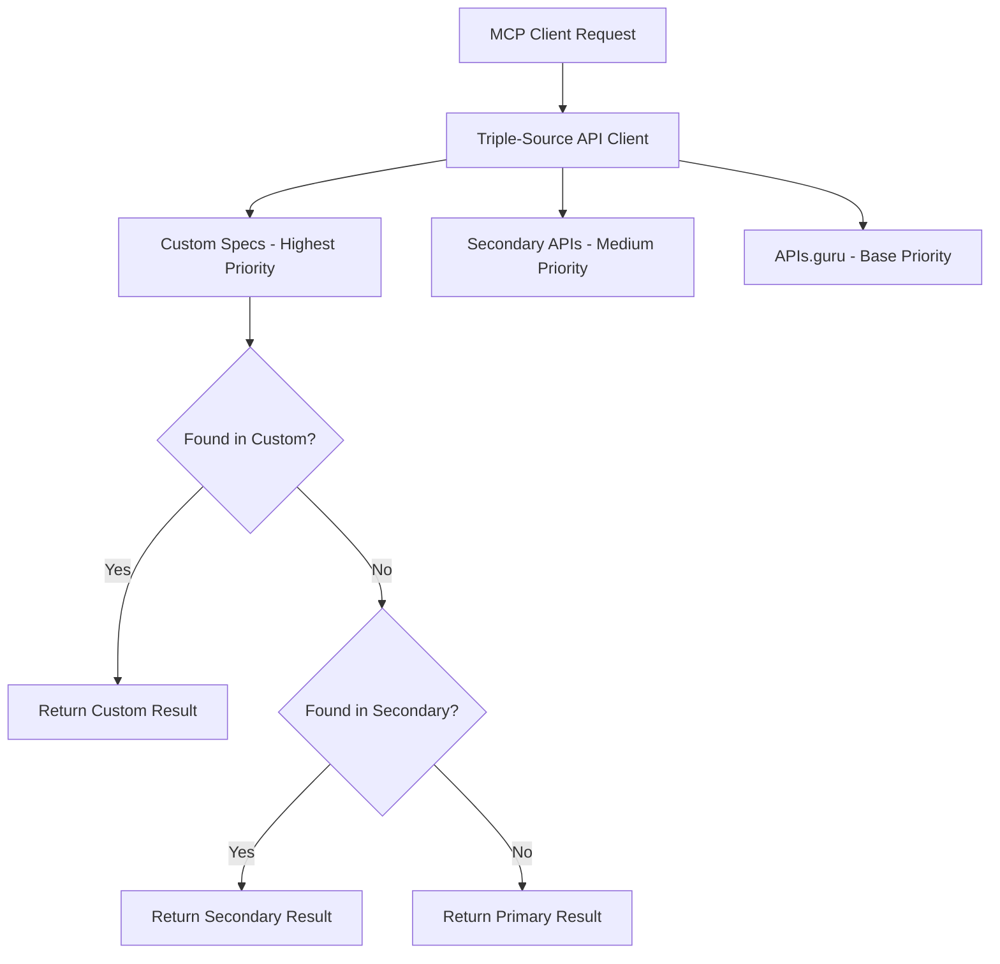

<h1 align="center">OpenAPI Directory MCP Server</h1>

<p align="center">
  <a href="https://www.npmjs.com/package/openapi-directory-mcp"></a>
  <a href="https://github.com/rawveg/openapi-directory-mcp/blob/main/LICENSE"></a>
  <a href="https://github.com/rawveg/openapi-directory-mcp"></a>
  <a href="https://github.com/sponsors/rawveg"></a>
</p>

---


A Model Context Protocol (MCP) server that provides access to the APIs.guru directory - the world's largest repository of OpenAPI specifications with over 3,000 API Specs from 600+ providers. **Now with custom OpenAPI spec import** - seamlessly integrate your own APIs alongside the public directory.

## Table of Contents

- [Acknowledgments](#acknowledgments)
- [Features](#features)
- [Context Optimization & Progressive Discovery](#-context-optimization--progressive-discovery)
- [Quick Start](#-quick-start)
- [Custom OpenAPI Specifications](#-custom-openapi-specifications)
- [Available Tools](#%EF%B8%8F-available-tools)
- [Available Resources](#-available-resources)
- [Available Prompts](#-available-prompts-context-optimized)
- [Configuration](#configuration)
- [Example Usage](#-example-usage)
- [Architecture](#%EF%B8%8F-architecture)
- [Performance](#-performance)
- [Development](#development)
- [Contributing](#-contributing)
- [License](#-license)
- [Support This Project](#%EF%B8%8F-support-this-project)
- [Support](#support)
- [Credits](#-credits)

---

## Acknowledgments

This project builds upon the exceptional work of [APIs.guru](https://apis.guru) and their comprehensive [OpenAPI Directory](https://github.com/APIs-guru/openapi-directory). The APIs.guru project maintains the largest repository of machine-readable API definitions, providing an invaluable resource to the developer community through their free API service at https://api.apis.guru/v2.

Their dedication to creating and maintaining this comprehensive directory of OpenAPI specifications makes projects like this possible. We are deeply grateful for their contribution to the open source ecosystem and their commitment to making API discovery accessible to everyone.

The source data is provided under the Creative Commons Zero v1.0 Universal License, reflecting their generous approach to knowledge sharing.

---

## Features

| Feature                       | Description                                                  |
|-------------------------------|--------------------------------------------------------------|
| **Zero Configuration**        | Works out of the box with sensible defaults                  |
| **Comprehensive API Coverage**| Access to 3,000+ API specs from APIs.guru                    |
| **Custom OpenAPI Import**     | Import and manage your own APIs with zero-touch integration  |
| **Context-Aware Security**    | Smart security scanning with legitimate pattern recognition  |
| **Context Optimized**         | Progressive discovery reduces context usage by ~95%          |
| **Smart Search Results**      | Relevance ranking + newest versions first + provider priority |
| **Intelligent Caching**       | 24-hour TTL persistent caching with management tools         |
| **Rich Tool Set**             | 22 specialized tools for API discovery and endpoint analysis |
| **Slash Commands**            | All prompts auto-exposed as Claude Code slash commands       |
| **Paginated Resources**       | Efficient data access with pagination support                |
| **NPX Ready**                 | Install and run with a single command                        |
| **Type Safe**                 | Built with TypeScript for reliability                        |

---

## 🎯 Context Optimization & Progressive Discovery

This MCP server implements a **progressive discovery approach** that dramatically reduces context usage, allowing you to explore many more APIs before hitting context limits.

### The Problem
Traditional API discovery tools return massive amounts of data that quickly saturate LLM context windows. For example, searching for "social media APIs" and fetching their full specifications could exhaust your context before providing useful answers.

### Our Solution: 95% Context Reduction
We've redesigned the discovery workflow into three efficient phases:

**🔍 Phase 1: Initial Discovery**
- `search_apis` returns minimal, paginated results (20 per page)
- `openapi://apis/summary` provides directory overview
- Quick browsing of 1,000+ APIs without context overload

**📋 Phase 2: Basic Evaluation**  
- `get_api_summary` provides essential details without endpoints
- Authentication, documentation, categories, and provider info
- Compare multiple APIs efficiently

**⚙️ Phase 3: Detailed Analysis**
- `get_endpoints` shows paginated endpoint lists (30 per page)
- `get_endpoint_details` for specific endpoint information
- `get_endpoint_schema` and `get_endpoint_examples` for implementation

### Smart Prompts Guide You
All 22 built-in prompts automatically use this progressive approach:
- `api_discovery` guides you through efficient API exploration
- `api_integration_guide` uses progressive endpoint discovery
- Each prompt prevents context saturation while maximizing useful information

---

## 🚀 Quick Start

### Local Development Setup

1. **Clone and build**:
```bash
git clone https://github.com/rawveg/openapi-directory-mcp.git
cd openapi-directory-mcp
npm install
npm run build
```

2. **Test locally**:
```bash
node dist/index.js
```

### Configuration for Local Development

#### Claude Desktop (Local)
```json
{
  "mcpServers": {
    "openapi-directory": {
      "command": "node",
      "args": ["/path/to/openapi-directory-mcp/dist/index.js"],
      "cwd": "/path/to/openapi-directory-mcp"
    }
  }
}
```

#### Claude Code (Local)
```bash
claude mcp add openapi-directory -- node /absolute/path/to/openapi-directory-mcp/dist/index.js
```

#### Cursor (Local)
```json
{
  "mcp.servers": {
    "openapi-directory": {
      "command": "node",
      "args": ["/path/to/openapi-directory-mcp/dist/index.js"],
      "cwd": "/path/to/openapi-directory-mcp"
    }
  }
}
```

#### Windsurf (Local)
```json
{
  "servers": {
    "openapi-directory": {
      "command": "node /path/to/openapi-directory-mcp/dist/index.js"
    }
  }
}
```

### NPX Installation

```bash
npx -y openapi-directory-mcp
```

#### Claude Desktop (NPX)
```json
{
  "mcpServers": {
    "openapi-directory": {
      "command": "npx",
      "args": ["-y", "openapi-directory-mcp"]
    }
  }
}
```

#### Claude Code (NPX)
```bash
claude mcp add openapi-directory -- npx -y openapi-directory-mcp
```

**Claude Code MCP Management**:
```bash
# List all configured MCP servers
claude mcp list

# Get details about the server
claude mcp get openapi-directory

# Remove the server
claude mcp remove openapi-directory

# Check server status in chat
/mcp
```

**🎯 Claude Code Slash Commands**: All 22 MCP prompts are automatically available as slash commands!

**Core Discovery & Analysis:**
- `/openapi-directory:api_discovery` - Discover APIs for specific use cases
- `/openapi-directory:api_integration_guide` - Generate integration guides
- `/openapi-directory:api_comparison` - Compare multiple APIs
- `/openapi-directory:authentication_guide` - Understand API authentication
- `/openapi-directory:code_generation` - Generate code examples
- `/openapi-directory:api_documentation_analysis` - Analyze API capabilities
- `/openapi-directory:troubleshooting_guide` - Debug integration issues

**Action-Oriented Code Generation:**
- `/openapi-directory:retrofit_api_client` - Retrofit existing codebase with typed API client
- `/openapi-directory:api_type_generator` - Generate TypeScript/language types from specs
- `/openapi-directory:api_test_suite` - Create comprehensive test suites
- `/openapi-directory:api_error_handler` - Build robust error handling with retry logic
- `/openapi-directory:api_migration_assistant` - Migrate between API versions/providers
- `/openapi-directory:api_sdk_wrapper` - Generate custom SDK wrappers
- `/openapi-directory:api_webhook_scaffold` - Scaffold webhook handlers
- `/openapi-directory:api_rate_limiter` - Implement intelligent rate limiting
- `/openapi-directory:api_graphql_wrapper` - Create GraphQL wrappers for REST APIs
- `/openapi-directory:api_batch_processor` - Build batch processing systems

**Authentication-Focused:**
- `/openapi-directory:api_auth_implementation` - Complete auth implementation
- `/openapi-directory:api_auth_flow_generator` - Generate OAuth2/OIDC flows
- `/openapi-directory:api_auth_middleware` - Build auth middleware for frameworks
- `/openapi-directory:api_auth_test_harness` - Create auth testing tools
- `/openapi-directory:api_auth_debugger` - Debug authentication issues

#### Cursor (NPX)
```json
{
  "mcp.servers": {
    "openapi-directory": {
      "command": "npx",
      "args": ["-y", "openapi-directory-mcp"]
    }
  }
}
```

#### Windsurf (NPX)
```json
{
  "servers": {
    "openapi-directory": {
      "command": "npx -y openapi-directory-mcp"
    }
  }
}
```

---

## 📁 Custom OpenAPI Specifications

Import and manage your own OpenAPI specifications alongside the public API directory. Custom specs are treated as **first-class citizens** with complete integration across all tools and prompts.

### ✨ Key Features

- **🎯 Frictionless Import**: Single command import from files or URLs
- **🔒 Context-Aware Security Scanning**: Intelligent detection of security issues with legitimate pattern recognition
- **⚡ Zero-Touch Integration**: Works seamlessly with all 22 existing tools and prompts  
- **🏆 Custom Always Wins**: Custom specs take precedence over any conflicts
- **📊 Interactive Management**: Full CLI for listing, removing, and maintaining specs
- **🔄 YAML/JSON Support**: Automatic conversion and validation
- **📂 Hierarchical Storage**: Organized in `custom/name/version` structure

### 🚀 Quick Start

#### Import a Custom Spec

```bash
# Interactive guided import (recommended for first time)
openapi-directory-mcp --import

# Direct import from local file
openapi-directory-mcp --import ./my-api.yaml --name my-api --version v1

# Import from URL with strict security scanning
openapi-directory-mcp --import https://api.example.com/openapi.json --name example-api --version v2 --strict-security

# Import with custom security options
openapi-directory-mcp --import ./internal-api.yaml --name internal-api --version v1 --skip-security
```

#### Manage Custom Specs

```bash
# List all imported custom specs
openapi-directory-mcp --list-custom

# Remove a custom spec
openapi-directory-mcp --remove-custom my-api:v1

# Re-run security scan on existing spec
openapi-directory-mcp --rescan-security my-api:v1

# Validate integrity of all custom specs
openapi-directory-mcp --validate-integrity

# Repair any integrity issues
openapi-directory-mcp --repair-integrity
```

### 🛡️ Security Scanning

Built-in context-aware security scanner that understands the difference between legitimate code patterns and actual security risks:

#### Security Rules

| Rule | Severity | Description |
|------|----------|-------------|
| **Code Injection** | Critical | Detects `eval()`, `exec()`, script injection patterns |
| **Path Traversal** | High | Identifies `../`, directory traversal attempts |
| **SQL Injection** | High | Finds SQL injection patterns and keywords |
| **XSS Patterns** | High | Detects cross-site scripting vulnerabilities |
| **Hardcoded Secrets** | Medium | Identifies API keys, tokens, passwords |
| **Unsafe URLs** | Medium | Flags suspicious domains and protocols |
| **Command Execution** | Critical | Detects system command execution patterns |

#### Context-Aware Intelligence

The scanner understands **legitimate patterns in examples**:

```yaml
# ✅ This is SAFE - Scanner recognizes it's in an example
paths:
  /logs/analyze:
    post:
      examples:
        datadog_query:
          value: 
            query: "eval(sum:system.cpu.usage{*})"  # Datadog query syntax
```

#### Security Modes

- **Normal** (default): Scans and reports issues, allows import
- **Strict**: Blocks import if any high/critical issues found
- **Skip**: Bypasses security scanning entirely

### 📂 Storage Architecture

Custom specs are stored in a hierarchical structure matching the API directory format:

```
~/.cache/openapi-directory-mcp/custom-specs/
├── manifest.json                    # Master index of all custom specs
└── custom/                          # All custom specs use "custom" provider
    ├── my-api/
    │   ├── v1.json                  # Normalized OpenAPI spec
    │   └── v2.json
    ├── internal-api/
    │   └── v1.json
    └── third-party-api/
        └── v1.json
```

### 🔄 Triple-Source Architecture

The MCP server now operates as a **triple-source system**:



**Precedence Rules**: Custom > Secondary > Primary (**Custom Always Wins**)

### 🔧 CLI Reference

#### Import Commands

```bash
--import [PATH/URL]     # Import spec (interactive if no path provided)
--name NAME             # Specify name for the imported spec  
--version VERSION       # Specify version for the imported spec
--skip-security         # Skip security scanning during import
--strict-security       # Block import on any medium+ security issues
```

#### Management Commands

```bash
--list-custom           # List all imported custom specs with details
--remove-custom ID      # Remove a custom spec (format: name:version)
--rescan-security ID    # Re-run security scan on existing spec
--validate-integrity    # Check integrity of custom spec storage
--repair-integrity      # Repair integrity issues automatically
```

#### General Commands

```bash
--help, -h              # Show help message with all commands
```

### 💡 Usage Examples

#### Interactive Import Workflow

```bash
$ openapi-directory-mcp --import

📋 Custom OpenAPI Spec Import Wizard
==================================================

📂 Enter the path or URL to your OpenAPI spec: ./company-api.yaml
🔍 Validating specification...
✅ Valid OpenAPI specification detected
📝 Enter a name for this API: company-api
🏷️  Enter a version identifier: v1.2.0
🔒 Security scanning? (strict/normal/skip) [normal]: normal

📦 Ready to import:
   Source: ./company-api.yaml
   Name: company-api
   Version: v1.2.0
   Security: normal

Proceed with import? (Y/n): y

📥 Importing OpenAPI spec from: ./company-api.yaml
📝 Name: company-api, Version: v1.2.0
🔍 Processing and validating specification...
🔒 Security scan completed:
✅ No security issues found
💾 Storing specification...
✅ Successfully imported custom spec: custom:company-api:v1.2.0
```

#### Direct Import Examples

```bash
# Import internal API with security scanning disabled
openapi-directory-mcp --import ./internal-api.yaml --name internal --version v1 --skip-security

# Import public API with strict security requirements
openapi-directory-mcp --import https://api.github.com/openapi.json --name github --version v3 --strict-security

# Import development API with normal security scanning
openapi-directory-mcp --import ./dev-api.json --name dev-api --version latest
```

#### Management Examples

```bash
# List all custom specifications
$ openapi-directory-mcp --list-custom

📚 Custom OpenAPI Specifications (3)
============================================================

1. company-api:v1.2.0
   📋 Company Internal API
   📄 Internal API for company services and data access
   📅 Imported: 12/15/2024 | 📊 156KB YAML
   🔒 Security: ✅ 0 issues | 📦 Source: file

2. github:v3
   📋 GitHub REST API
   📄 GitHub's REST API for repository and user management
   📅 Imported: 12/14/2024 | 📊 2.1MB JSON
   🔒 Security: ⚠️ 2 issues | 📦 Source: url

3. dev-api:latest
   📋 Development API
   📄 Development environment API for testing
   📅 Imported: 12/13/2024 | 📊 45KB JSON
   🔒 Security: ✅ 0 issues | 📦 Source: file

💾 Total: 3 specs, 2.3MB
```

### 🔌 Seamless Integration

Once imported, custom specs work automatically with **all existing functionality** through intelligent API routing and parameter recognition:

#### Tools Integration

```javascript
// All 22 tools work with custom specs automatically with intelligent routing

// Search automatically prioritizes custom specs
const results = await search_apis({ query: "company" });
// Returns: custom:company-api:v1.2.0 first (if matches), then public APIs

// Get details works with automatic parameter recognition
const details = await get_api_summary({ api_id: "custom:company-api:v1.2.0" });

// Endpoint analysis works identically with smart routing
const endpoints = await get_endpoints({ api_id: "custom:company-api:v1.2.0" });
```

#### Prompts Integration

```bash
# All 22 prompts work with custom specs automatically

# API discovery finds custom specs first
/openapi-directory:api_discovery
# Arguments: { use_case: "internal data access" }
# Result: Discovers and recommends custom:company-api:v1.2.0

# Integration guides work seamlessly
/openapi-directory:api_integration_guide  
# Arguments: { api_name: "custom:company-api:v1.2.0", language: "Python" }
# Result: Complete integration guide using your custom spec

# Code generation uses custom specs
/openapi-directory:code_generation
# Arguments: { api_id: "custom:company-api:v1.2.0", endpoint: "/users" }
# Result: Generated code for your custom API endpoints
```

#### Resources Integration

```javascript
// Resources automatically include custom specs with priority handling

// Providers list dynamically includes "custom" when specs exist
const providers = await readResource("openapi://providers");
// Returns: [..., "custom"] (only when custom specs are imported)

// Paginated APIs automatically prioritize custom specs
const apis = await readResource("openapi://apis/page/1");
// Custom specs appear first, then public APIs

// Summary automatically aggregates custom specs in metrics
const summary = await readResource("openapi://apis/summary");
// Directory counts and popular lists seamlessly include custom specs
```

### 🎯 Best Practices

#### Naming Conventions

```bash
# Use semantic versioning
--name my-api --version v1.0.0
--name my-api --version v1.1.0-beta

# Use descriptive names
--name user-management-api --version v2
--name payment-gateway-api --version production
--name analytics-api --version latest
```

#### Security Recommendations

```bash
# For production APIs, use strict scanning
--strict-security

# For internal/development APIs, use normal scanning
# (default behavior)

# Only skip security for trusted, internal-only APIs
--skip-security
```

#### Version Management

```bash
# Import new versions as separate entries
openapi-directory-mcp --import ./api-v1.yaml --name my-api --version v1
openapi-directory-mcp --import ./api-v2.yaml --name my-api --version v2

# Remove old versions when no longer needed
openapi-directory-mcp --remove-custom my-api:v1
```

#### Storage Maintenance

```bash
# Regular integrity checks
openapi-directory-mcp --validate-integrity

# Automatic repairs when needed
openapi-directory-mcp --repair-integrity

# Clean up unused specs
openapi-directory-mcp --list-custom  # Review list
openapi-directory-mcp --remove-custom old-api:v1
```

### 🚨 Error Handling

#### Common Import Issues

| Error | Cause | Solution |
|-------|--------|----------|
| **Invalid OpenAPI spec** | Malformed YAML/JSON | Validate spec with OpenAPI tools |
| **Name already exists** | Duplicate name:version | Use different version or remove existing |
| **Security issues found** | Potential security risks | Review issues, use `--skip-security` if safe |
| **File not found** | Invalid path | Check file path and permissions |
| **Network error** | URL unreachable | Verify URL and network connectivity |

#### Integrity Issues

```bash
# Check for issues
$ openapi-directory-mcp --validate-integrity
❌ Found 2 integrity issues:
   • Missing spec file: custom:old-api:v1
   • Orphaned file: custom/unknown-api/v1.json

# Repair automatically
$ openapi-directory-mcp --repair-integrity
✅ Repaired 2 issues:
   • Removed orphaned manifest entry: custom:old-api:v1
   • Cleaned up orphaned file: custom/unknown-api/v1.json
```

### 🔧 Environment Configuration

Custom specs respect the same environment variables:

```bash
# Change cache directory for custom specs
export OPENAPI_DIRECTORY_CACHE_DIR=/custom/cache/path

# Custom specs will be stored at:
# /custom/cache/path/custom-specs/
```

### ⚡ Automatic Cache Invalidation

The system uses a **flag file approach** for seamless cache synchronization between CLI operations and the running MCP server:

#### How It Works
1. **Import/Remove Operations**: When you import or remove custom specs via CLI, a `.invalidate` flag file is created
2. **Automatic Detection**: The MCP server checks for this flag on every cache access
3. **Instant Invalidation**: If the flag exists, cache is cleared and the flag is removed
4. **Zero Restart Required**: Changes are immediately visible without restarting Claude Desktop or the MCP server

#### Technical Benefits
- **Cross-Process Communication**: CLI and MCP server communicate via filesystem flags
- **Immediate Consistency**: No stale cache issues when importing new specs
- **Performance Optimized**: Only invalidates when actual changes occur
- **Bulletproof**: Works across all operating systems and process architectures

```bash
# This workflow now works seamlessly:
openapi-directory-mcp --import ./new-api.yaml --name new-api --version v1
# ↑ Creates .invalidate flag

# Immediately available in Claude Desktop (no restart needed)
# ↑ MCP server detects flag, clears cache, removes flag
```

---

## 🛠️ Available Tools

**All 22 tools seamlessly support custom imported APIs with zero configuration required.** Custom APIs are automatically prioritized in search results and tool responses.

### Core API Discovery Tools (Context Optimized)

| Tool                  | Description                                    |
|-----------------------|------------------------------------------------|
| `get_providers`       | List all API providers                         |
| `get_provider_apis`   | Get APIs for a specific provider               |
| `get_provider_services`| Get services for a provider                   |
| `get_api`             | Get detailed API information                   |
| `list_all_apis`       | ⚠️ **Use with caution** - Returns massive data |
| `get_metrics`         | Directory statistics                           |
| `search_apis`         | 🎯 **Smart search**: custom APIs first + relevance ranking + newest versions (20/page) |

### Progressive Discovery Tools (Recommended)

| Tool                | Description                                      |
|---------------------|--------------------------------------------------|
| `get_api_summary`   | 📋 **Phase 2** - Basic API info without endpoints |
| `get_endpoints`     | ⚙️ **Phase 3** - Paginated endpoint list (30 per page) |
| `get_endpoint_details`| ⚙️ **Phase 3** - Detailed endpoint information |
| `get_endpoint_schema`| ⚙️ **Phase 3** - Request/response schemas |
| `get_endpoint_examples`| ⚙️ **Phase 3** - Request/response examples |

### Utility Tools

| Tool                | Description                |
|---------------------|----------------------------|
| `get_popular_apis`  | Get popular APIs           |
| `get_recently_updated`| Get recently updated APIs |
| `get_provider_stats`| Provider statistics        |
| `get_openapi_spec`  | Fetch OpenAPI specifications|
| `analyze_api_categories`| Analyze API categories   |

### Cache Management Tools

| Tool                | Description                |
|---------------------|----------------------------|
| `cache_stats`       | Get cache statistics and usage info |
| `list_cache_keys`   | List all cached keys with total count |
| `clear_cache`       | Clear all cache entries    |
| `clear_cache_key`   | Clear a specific cache key |
| `cache_info`        | Get cache configuration and settings |

---

## 📦 Available Resources

### Context-Optimized Resources

| Resource                  | Description                                      |
|---------------------------|--------------------------------------------------|
| `openapi://providers`     | Complete provider list                           |
| `openapi://metrics`       | Directory metrics                                |
| `openapi://apis/summary`  | 🎯 **Recommended** - Directory overview with popular APIs |

### Paginated API Resources

| Resource                  | Description                                      |
|---------------------------|--------------------------------------------------|
| `openapi://apis/page/1`   | 🔍 **Phase 1** - APIs 1-50 with minimal data    |
| `openapi://apis/page/2`   | 🔍 **Phase 1** - APIs 51-100 with minimal data  |
| `...`                     | Pages 1-20 available (50 APIs per page)         |
| `openapi://apis/page/20`  | 🔍 **Phase 1** - APIs 951-1000 with minimal data|

**Note**: The previous `openapi://list` resource has been removed as it exceeded context limits with massive data. Use the paginated `openapi://apis/page/N` resources or `openapi://apis/summary` instead.

---

## 💡 Available Prompts (Context-Optimized)

All prompts automatically use the progressive discovery workflow to prevent context saturation.

**🎯 Claude Code Users**: All prompts below are available as slash commands! Just type `/openapi-directory:` and you'll see all available commands with descriptions.

### Core Discovery & Analysis Prompts

| Prompt                       | Purpose                                      | Workflow                |
|------------------------------|----------------------------------------------|-------------------------|
| `api_discovery`              | 🎯 **Most Popular** - Discover APIs for use cases | 3-phase progressive discovery |
| `api_integration_guide`      | Step-by-step integration guide for APIs       | Progressive endpoint exploration |
| `api_comparison`             | Compare multiple APIs for functionality       | Efficient API summaries  |
| `authentication_guide`       | Understand API authentication methods         | Focused auth analysis    |
| `code_generation`            | Generate code examples for API usage          | Endpoint-specific examples |
| `api_documentation_analysis` | Analyze API capabilities and limitations      | Progressive capability mapping |
| `troubleshooting_guide`      | Debug API integration issues                  | Targeted problem analysis |

### Action-Oriented Code Generation Prompts

| Prompt                       | Purpose                                      | Use Case                |
|------------------------------|----------------------------------------------|-------------------------|
| `retrofit_api_client`        | Retrofit existing codebase with typed API client | Modernize legacy integrations |
| `api_type_generator`         | Generate TypeScript/language types from OpenAPI specs | Type safety & IDE support |
| `api_test_suite`             | Create comprehensive test suites for API integrations | Quality assurance & CI/CD |
| `api_error_handler`          | Build robust error handling with retry logic | Production reliability |
| `api_migration_assistant`    | Migrate between different API versions/providers | API modernization |
| `api_sdk_wrapper`            | Generate custom SDK wrappers around APIs | Developer experience |
| `api_webhook_scaffold`       | Scaffold webhook handlers and verification | Event-driven architectures |
| `api_rate_limiter`           | Implement intelligent rate limiting | API quota management |
| `api_graphql_wrapper`        | Create GraphQL wrappers for REST APIs | Modern API interfaces |
| `api_batch_processor`        | Build batch processing systems for API calls | High-volume operations |

### Authentication-Focused Prompts

| Prompt                       | Purpose                                      | Auth Types              |
|------------------------------|----------------------------------------------|-------------------------|
| `api_auth_implementation`    | Complete auth implementation for any API    | OAuth2, Bearer, API Key, Basic |
| `api_auth_flow_generator`    | Generate OAuth2/OIDC authorization flows    | OAuth2, OIDC, PKCE     |
| `api_auth_middleware`        | Build auth middleware for frameworks        | Express, FastAPI, Spring |
| `api_auth_test_harness`      | Create auth testing and validation tools    | Unit & integration tests |
| `api_auth_debugger`          | Debug authentication issues and flows       | Token inspection, flow tracing |

**💡 Pro Tips**: 
- Start with `api_discovery` for any use case - guides you through efficient exploration
- Use `retrofit_api_client` to modernize existing codebases with proper API clients
- Try `api_auth_implementation` for complete authentication solutions with any API

## Configuration

The server works with zero configuration but supports customization via environment variables:

```bash
export CACHE_TTL=86400000  # Cache TTL in milliseconds (default: 24 hours)
export DISABLE_CACHE=false  # Disable caching (default: false)
export OPENAPI_DIRECTORY_CACHE_DIR=~/.cache/openapi-directory-mcp  # Cache directory
export PRIMARY_API_BASE_URL=https://api.apis.guru/v2  # Primary API URL
export SECONDARY_API_BASE_URL=https://api.openapidirectory.com  # Secondary API URL
```

---

## 🧑‍💻 Example Usage

### 🎯 Progressive Discovery Workflow (Recommended)

```javascript
// Phase 1: Initial Discovery (Context-efficient search with relevance ranking)
const searchResults = await search_apis({ 
  query: "payment", 
  page: 1, 
  limit: 20 
});
// Note: Smart search shows provider APIs first + newest versions first within same relevance!

// Phase 2: Basic Evaluation (Get summaries for promising APIs)
const stripeInfo = await get_api_summary({ api_id: "stripe.com" });
const paypalInfo = await get_api_summary({ api_id: "paypal.com" });

// Phase 3: Detailed Analysis (Only for chosen API)
const endpoints = await get_endpoints({ 
  api_id: "stripe.com", 
  page: 1, 
  limit: 30 
});

// Get specific endpoint details for implementation
const paymentEndpoint = await get_endpoint_details({
  api_id: "stripe.com",
  method: "POST", 
  path: "/v1/charges"
});

// Get schemas and examples for coding
const schemas = await get_endpoint_schema({
  api_id: "stripe.com",
  method: "POST", 
  path: "/v1/charges"
});

const examples = await get_endpoint_examples({
  api_id: "stripe.com",
  method: "POST", 
  path: "/v1/charges"
});
```

### 📋 Efficient Resource Access

```javascript
// Get directory overview (recommended starting point)
const summary = await readResource("openapi://apis/summary");

// Browse APIs in pages (50 per page)
const page1 = await readResource("openapi://apis/page/1");
const page2 = await readResource("openapi://apis/page/2");

// ⚠️ Avoid this - returns massive data
// const allApis = await list_all_apis(); // Can saturate context!
```

### 🎯 Smart Prompt Usage

```javascript
// Best practice: Use api_discovery prompt for any use case
// Prompt: api_discovery  
// Arguments: { 
//   use_case: "send emails", 
//   requirements: "free tier available, good documentation" 
// }

// The prompt automatically guides through:
// 1. Efficient search with pagination
// 2. API summaries for comparison  
// 3. Progressive endpoint discovery
// 4. Implementation details only when needed

// Integration guide with progressive approach
// Prompt: api_integration_guide
// Arguments: { 
//   api_name: "Gmail API", 
//   programming_language: "JavaScript",
//   use_case: "send automated notifications"
// }
```

### Legacy Tools (Use with Caution)

```javascript
// These work but can consume lots of context:
const metrics = await get_metrics();
const providerStats = await get_provider_stats({ provider: "amazonaws.com" });
const popularApis = await get_popular_apis({ limit: 10 });
```

---

## 🏗️ Architecture

The server uses a modular, context-optimized architecture:

- **Triple-Source API Client**: Handles communication with APIs.guru, secondary APIs, and custom imported specs
- **Enhanced Dual-Source Routing**: Intelligent API resolution with custom-first precedence and fallback handling
- **Custom Spec Management**: Complete import, storage, and lifecycle management for user-provided OpenAPI specs
- **Context-Aware Security Scanner**: Intelligent security analysis with legitimate pattern recognition  
- **Flag-Based Cache Invalidation**: Automatic cross-process cache synchronization using filesystem flags
- **Persistent Cache Manager**: Implements 24-hour TTL filesystem caching with real-time invalidation
- **CLI Interface**: Full-featured command-line tool with interactive wizards and batch operations
- **Tool Generator**: Creates MCP tools with pagination and context limits
- **Resource Handler**: Manages paginated resource streaming (20 pages of 50 APIs each)
- **Progressive Discovery**: Smart workflow guides preventing context saturation
- **Prompt System**: 22 context-aware prompts using efficient discovery patterns
- **Cache Management**: 5 tools for cache inspection and maintenance

### New in v1.3.0

#### Hybrid CLI/MCP Architecture
The application now operates in **dual mode**:
- **CLI Mode**: When arguments are provided, runs as a command-line tool for spec management
- **MCP Mode**: When no arguments are provided, runs as an MCP server for Claude Desktop

```bash
# CLI Mode - Import management
openapi-directory-mcp --import ./api.yaml --name my-api --version v1

# MCP Mode - Service for Claude Desktop  
openapi-directory-mcp  # Starts MCP server
```

#### Enhanced API Client Architecture
```
DualSourceClient
├── Custom API Detection & Routing
├── Parameter Pattern Recognition  
├── Fallback Chain Management
└── Cache-Aware Resolution

Custom Provider Handling:
  provider="custom" + service="APIName" 
  → Routes to: customClient.getAPI("custom", "APIName")
  → Bypasses standard provider:service:version pattern
```

---

## ⚡ Performance

| Metric              | Value                         |
|---------------------|-------------------------------|
| **Cold Start**      | < 2 seconds                   |
| **Cache Hit**       | < 50ms response time          |
| **Cache Miss**      | < 500ms response time         |
| **Memory**          | < 100MB steady state          |
| **Context Usage**   | 🎯 **95% reduction** vs traditional approaches |
| **API Discovery**   | Explore 100+ APIs before context limits |
| **Pagination**      | 20-50 results per request (configurable) |

## Development

### Prerequisites

- Node.js >= 18.0.0
- npm or yarn

### Setup

```bash
git clone https://github.com/rawveg/openapi-directory-mcp.git
cd openapi-directory-mcp
npm install
```

### Development Workflow

```bash
# Build the project
npm run build

# Run locally for testing
node dist/index.js

# Run tests
npm test
npm run test:coverage

# Development with auto-rebuild
npm run dev

# Lint code
npm run lint
npm run lint:fix

# Run pre-flight checks (recommended before pushing)
npm run preflight
```

### Pre-flight Checks

This project includes a comprehensive pre-flight check system that catches common issues before they reach CI/CD:

```bash
# Run all pre-flight checks
npm run preflight
```

Pre-flight checks include:
- **Build Output** - Ensures project is built
- **Tool Exposure** - Validates all tool files are exposed (auto-adjusts to file count)
- **Prompt Exposure** - Validates all prompt files are exposed (auto-adjusts to file count)
- **Mock Validation** - Ensures test mocks implement required methods
- **TypeScript** - Validates TypeScript compilation
- **ESLint** - Validates code style and quality

#### Benefits:
- ⚡ **Fast Failure** - Catches issues in seconds instead of minutes
- 💰 **Cost Savings** - Avoids running expensive CI/CD for doomed builds
- 🎯 **Specific Errors** - Provides exact fix instructions
- 🔄 **Self-Adjusting** - No hardcoded counts, derives from filesystem

📚 **[Full Pre-flight Documentation](docs/preflight-checks.md)**

### Git Hooks Setup

For automatic pre-push validation:

```bash
# Install git hooks
./scripts/install-hooks.sh

# This installs:
# - pre-push: Runs pre-flight checks before pushing
```

To bypass hooks in emergencies (not recommended):
```bash
git push --no-verify
```

### Automated Release Process

This project uses an automated release workflow triggered by version tags:

#### Creating a Release

1. **Ensure main branch is ready**:
   ```bash
   # Make sure you're on main and up to date
   git checkout main
   git pull origin main
   
   # Ensure all tests pass
   npm run validate
   ```

2. **Update version and create tag**:
   ```bash
   # Update version in package.json (choose one)
   npm version patch  # 1.0.0 -> 1.0.1
   npm version minor  # 1.0.0 -> 1.1.0  
   npm version major  # 1.0.0 -> 2.0.0
   
   # Or for pre-releases
   npm version prerelease --preid=beta  # 1.0.0 -> 1.0.1-beta.0
   ```

3. **Push tag to trigger release**:
   ```bash
   # Push the tag (this triggers the automated workflow)
   git push origin --tags
   
   # Also push the commit
   git push origin main
   ```

#### CI/CD Pipeline

All pushes and pull requests run through our comprehensive CI/CD pipeline:

1. **Pre-flight Checks** (runs first, fails fast):
   - Build validation
   - Plugin exposure verification
   - Mock completeness check
   - TypeScript compilation
   - Linting

2. **Main Pipeline** (only runs if pre-flight passes):
   - Code quality checks
   - Multi-node version testing (18, 20, 22)
   - Plugin architecture validation
   - Security scanning
   - Test suites (unit, feature, integration, regression)

This staged approach saves CI/CD resources by catching common issues early.

#### What Happens Automatically

The GitHub Actions workflow will:

1. **Pre-Release Validation**:
   - ✅ Verify version matches tag
   - ✅ Check for changelog entry (optional)
   - ✅ Run full test suite (lint, typecheck, tests)
   - ✅ Build project and validate package contents

2. **NPM Publishing**:
   - ✅ Build production version
   - ✅ Configure NPM authentication
   - ✅ Publish to NPM (stable or beta tag based on version)
   - ✅ Verify publication and test installation

3. **GitHub Release Creation**:
   - ✅ Generate changelog from commits
   - ✅ Create GitHub release with installation instructions
   - ✅ Upload build artifacts
   - ✅ Mark as pre-release if beta/alpha/rc version

4. **Post-Release Verification**:
   - ✅ Verify NPM package is accessible
   - ✅ Verify GitHub release is created
   - ✅ Update package badges

#### Manual Publishing (Fallback)

```bash
# Only use if automated process fails
npm login
npm run build
npm test
npm publish
```

#### Branch Protection

The `main` branch is protected and requires:
- ✅ Pull requests for all changes
- ✅ All CI checks to pass
- ✅ Up-to-date branches before merging
- ✅ No direct pushes to main

#### Release Requirements

- All tests must pass
- Version in package.json must match git tag
- Optional but recommended: Update CHANGELOG.md
- Required for NPM publishing: NPM_TOKEN secret configured

### Local Testing with MCP Clients

After building, you can test with any MCP client using the absolute path:

```bash
# Get absolute path
pwd
# Example: /Users/yourname/projects/openapi-directory-mcp

# Use in client config:
node /Users/yourname/projects/openapi-directory-mcp/dist/index.js
```

### Testing NPX Package Locally

To test the NPX installation before publishing:

```bash
# Create a local package
npm pack

# Test NPX installation from local tarball
npx ./openapi-directory-mcp-1.0.0.tgz
```

#### Option 1: Use Tarball Directly
```bash
# Claude Code with local tarball
claude mcp add openapi-directory -- npx -y ./openapi-directory-mcp-1.0.0.tgz

# Claude Desktop with local tarball
{
  "mcpServers": {
    "openapi-directory": {
      "command": "npx",
      "args": ["-y", "./openapi-directory-mcp-1.0.0.tgz"],
      "cwd": "/Users/yourname/projects/openapi-directory-mcp"
    }
  }
}
```

#### Option 2: Install Globally First
```bash
# Install globally for testing
npm install -g ./openapi-directory-mcp-1.0.0.tgz

# Find the installed binary path
which openapi-directory-mcp

# Use direct path (NPX still tries to fetch from registry)
claude mcp add openapi-directory -- /path/to/openapi-directory-mcp

# For Claude Desktop, use direct path
{
  "mcpServers": {
    "openapi-directory": {
      "command": "/path/to/openapi-directory-mcp"
    }
  }
}

# Uninstall when done testing
npm uninstall -g openapi-directory-mcp
```

**Note**: Even with global installation, `npx openapi-directory-mcp` will try to fetch from the NPM registry first and fail with 404. Use the direct binary path instead.

---

## 🔧 Plugin Architecture

This MCP server features a **dual plugin architecture** that enables zero-touch extensibility for both prompts and tools. All components are automatically discovered and loaded at startup from organized category folders.

### Architecture Overview

#### Prompts Plugin System
```
src/prompts/
├── core-discovery/         # API discovery and analysis prompts
│   ├── api-discovery.ts
│   ├── api-integration-guide.ts
│   ├── api-comparison.ts
│   ├── authentication-guide.ts
│   ├── code-generation.ts
│   ├── api-documentation-analysis.ts
│   ├── troubleshooting-guide.ts
│   └── api-performance-analyzer.ts
├── action-oriented/        # Code generation and automation prompts
│   ├── retrofit-api-client.ts
│   ├── api-type-generator.ts
│   ├── api-test-suite.ts
│   ├── api-error-handler.ts
│   ├── api-migration-assistant.ts
│   ├── api-sdk-wrapper.ts
│   ├── api-webhook-scaffold.ts
│   ├── api-rate-limiter.ts
│   ├── api-graphql-wrapper.ts
│   └── api-batch-processor.ts
├── authentication/         # Authentication-focused prompts
│   ├── api-auth-implementation.ts
│   ├── api-auth-flow-generator.ts
│   ├── api-auth-middleware.ts
│   ├── api-auth-test-harness.ts
│   └── api-auth-debugger.ts
├── loader.ts              # Auto-discovery system
├── types.ts               # Prompt type definitions
└── templates.ts           # Main prompt interface
```

#### Tools Plugin System
```
src/tools/
├── api-discovery/          # Core API discovery tools
│   ├── get-providers.ts
│   ├── get-provider-services.ts
│   ├── list-all-apis.ts
│   └── get-metrics.ts
├── api-details/            # Detailed API information tools
│   ├── get-api.ts
│   ├── get-api-summary.ts
│   ├── get-openapi-spec.ts
│   ├── get-provider-stats.ts
│   └── search-apis.ts
├── endpoint-tools/         # API endpoint analysis tools
│   ├── get-endpoints.ts
│   ├── get-endpoint-details.ts
│   ├── get-endpoint-schema.ts
│   └── get-endpoint-examples.ts
├── cache-tools/           # Cache management tools
│   ├── cache-stats.ts
│   ├── cache-info.ts
│   ├── list-cache-keys.ts
│   ├── clear-cache.ts
│   └── clear-cache-key.ts
├── provider-tools/        # Provider-specific tools
│   └── get-provider-apis.ts
├── utility-tools/         # Analysis and utility tools
│   ├── analyze-api-categories.ts
│   ├── get-popular-apis.ts
│   └── get-recently-updated.ts
├── loader.ts             # Auto-discovery system
├── registry.ts           # Tool organization
├── handler.ts            # MCP integration
└── types.ts              # Tool type definitions
```

### Adding New Prompts

**Zero Development Overhead**: Simply create a new `.ts` file in the appropriate category folder:

1. **Create the prompt file**:
```typescript
// src/prompts/core-discovery/my-new-prompt.ts
import { PromptTemplate } from '../types.js';

export const prompt: PromptTemplate = {
  name: "my_new_prompt",
  description: "Description of what this prompt does",
  arguments: [
    {
      name: "api_name",
      description: "Name of the API to work with",
      required: true
    }
  ],
  generateMessages: (args) => [
    {
      role: "user",
      content: {
        type: "text",
        text: `Your prompt content here using ${args.api_name}`
      }
    }
  ]
};

export default prompt;
```

2. **That's it!** The system will:
   - ✅ Automatically discover your prompt at startup
   - ✅ Make it available as `/openapi-directory:my_new_prompt`
   - ✅ Include it in the appropriate category
   - ✅ Validate the prompt structure
   - ✅ Handle all MCP protocol interactions

### Adding New Tools

**Zero Development Overhead**: Simply create a new `.ts` file in the appropriate category folder:

1. **Create the tool file**:
```typescript
// src/tools/api-discovery/my-new-tool.ts
import { z } from 'zod';
import { ToolDefinition, ToolContext } from '../types.js';

export const tool: ToolDefinition = {
  name: 'my_new_tool',
  description: 'Description of what this tool does',
  inputSchema: {
    type: 'object',
    properties: {
      api_name: {
        type: 'string',
        description: 'Name of the API to work with',
      },
    },
    required: ['api_name'],
  },
  async execute(args: any, context: ToolContext): Promise<any> {
    const schema = z.object({
      api_name: z.string(),
    });
    const params = schema.parse(args);
    
    // Your tool logic here using:
    // - context.apiClient for API operations
    // - context.cacheManager for cache operations
    
    return { result: `Processed ${params.api_name}` };
  }
};

export default tool;
```

2. **That's it!** The system will:
   - ✅ Automatically discover your tool at startup
   - ✅ Make it available through the MCP interface
   - ✅ Include it in the appropriate category
   - ✅ Validate the tool structure and parameters
   - ✅ Handle all MCP protocol interactions

### Adding New Categories

Create new folders under `src/prompts/` or `src/tools/` and add files inside:

```bash
# For prompts
mkdir src/prompts/my-category
# Add .ts files with prompt exports

# For tools  
mkdir src/tools/my-category
# Add .ts files with tool exports
```

The auto-loaders will discover and organize them automatically.

### Plugin Architecture Benefits

- **Single Responsibility**: Each component is ~15-70 lines
- **Zero Touch Extension**: No code changes needed for new components
- **Organized**: Clear folder-based categorization
- **Maintainable**: Easy to find, edit, and test individual components
- **Scalable**: Unlimited prompts/tools and categories supported
- **Type Safe**: Full TypeScript validation and IntelliSense
- **Consistent**: Same architecture pattern for both prompts and tools

---

## 🤝 Contributing

1. Fork the repository
2. Create a feature branch
3. Make your changes (see Plugin Architecture above for adding prompts)
4. Add tests if needed
5. Submit a pull request

**Plugin Contributions**: Thanks to our dual plugin architecture, adding new prompts and tools is incredibly easy! Just follow the patterns above and submit a PR.

---

## 📝 License

This project is licensed under the MIT License - see the [LICENSE](LICENSE) file for details.

---

## ❤️ Support This Project

> **If you find this MCP server valuable, especially if you're using it in a commercial context, please consider supporting its development through [GitHub Sponsors](https://github.com/sponsors/rawveg).**

### Our Commitment

> **All sponsorship proceeds for this project are shared equally (50/50) with the [APIs.guru](https://apis.guru) project in recognition of their foundational work and the ongoing costs of maintaining the API infrastructure this project depends upon.**

> By sponsoring this project, you're not just supporting this MCP server - you're helping sustain the entire ecosystem that makes comprehensive API discovery possible. APIs.guru maintains over 3,000 API specifications and provides free API access to the developer community. Your support helps keep this invaluable resource available for everyone.

## Support

| Support Type  | Link                                                            |
|--------------|-----------------------------------------------------------------|
| **Issues**   | [GitHub Issues](https://github.com/rawveg/openapi-directory-mcp/issues)        |
| **Docs**     | [API Reference](docs/API.md)                                     |
| **Examples** | [Examples Directory](examples/)                                  |

---

## 🙏 Credits

- Built with [Model Context Protocol](https://github.com/modelcontextprotocol/specification)
- API data from [APIs.guru](https://apis.guru/)
- Maintained by the OpenAPI Directory MCP team
